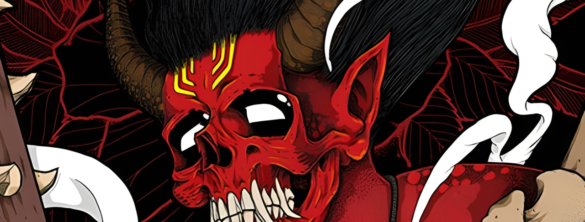

# 
🏴‍☠️ GOJIN REBEL 🏴‍☠️

<b>"THE SYSTEM IS BROKEN. WE ARE THE PATCH."</b>

  

## 🌐 DIRECT CHANNEL

# 💻 TECH ARSENAL (REBEL STACK)
> Pure Code. No Templates. No Mercy.

 
 
 

---

# 📊 THE CRIME SCENE (STATS)

### 🔝 HIGH VALUE TARGETS

---

## 🕹️ CONTRIBUTION VIBES
<picture>
  <source media="(prefers-color-scheme: dark)" srcset="https://raw.githubusercontent.com/Ghaizansyandana/Ghaizansyandana/output/pacman-contribution-graph-dark.svg">
  <source media="(prefers-color-scheme: light)" srcset="https://raw.githubusercontent.com/Ghaizansyandana/Ghaizansyandana/output/pacman-contribution-graph.svg">
  
</picture>

 
<b>STAY LOUD. STAY CODING.</b>

